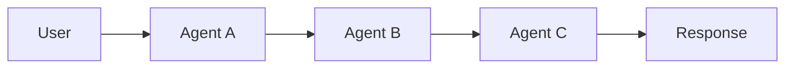
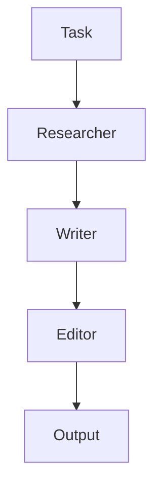
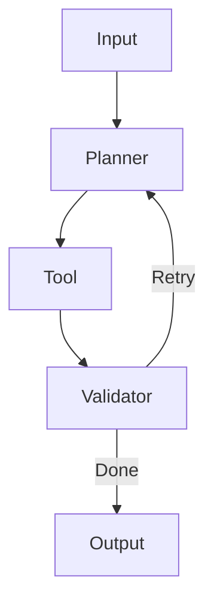

#  AutoGen vs CrewAI vs LangGraph  


### Complete Guide with Benchmarks, Diagrams & Code Examples

---

## 👋 Welcome

This repository compares three popular AI agent frameworks:

- AutoGen  
- CrewAI  
- LangGraph  

with real-world insights, architecture, and benchmarks.

---

## 🧠 Quick Summary

| Framework | Best For | Complexity | Control |
|----------|---------|-----------|--------|
| AutoGen | Conversational agents | Medium | Medium |
| CrewAI | Fast workflows | Easy | Low |
| LangGraph | Production systems | Hard | Very High |

---

## 🏗️ Architecture (Mermaid)

### AutoGen



### CrewAI



### LangGraph



---

## ⚙️ Feature Comparison

| Feature | AutoGen | CrewAI | LangGraph |
|--------|--------|--------|-----------|
| Multi-Agent | ✅ | ✅ | ✅ |
| Workflow Control | ❌ | ⚠️ | ✅ |
| State Handling | ❌ | ⚠️ | ✅ |
| Debugging | ❌ | ✅ | ⚠️ |
| Production Ready | ⚠️ | ⚠️ | ✅ |

---

## 💻 Code Examples

### AutoGen

```python
from autogen import AssistantAgent, UserProxyAgent

assistant = AssistantAgent("assistant")
user = UserProxyAgent("user")

user.initiate_chat(assistant, message="Explain AI agents")
```

---

### CrewAI

```python
from crewai import Agent, Task, Crew

agent = Agent(role="Writer", goal="Write blog")
task = Task(description="Blog on AI")

crew = Crew(agents=[agent], tasks=[task])
print(crew.run())
```

---

### LangGraph

```python
from langgraph.graph import StateGraph

def step(state):
    return {"data": state["data"] + " processed"}

graph = StateGraph(dict)
graph.add_node("step", step)
graph.set_entry_point("step")

app = graph.compile()
print(app.invoke({"data": "input"}))
```

---

## 📊 Benchmark Comparison

> ⚠️ Note: Benchmarks are indicative and vary based on model, infra, and design.

### 🔹 Latency (Response Time)

| Framework | Avg Latency |
|----------|------------|
| AutoGen | ⏱️ High (multi-turn conversations) |
| CrewAI | ⚡ Medium (sequential tasks) |
| LangGraph | ⚡ Low–Medium (optimized workflows) |

👉 Insight:  
- AutoGen is slower due to multiple agent conversations  
- LangGraph is faster due to controlled execution  

---

### 🔹 Cost (LLM Token Usage)

| Framework | Cost Efficiency |
|----------|----------------|
| AutoGen | 💸 High cost |
| CrewAI | 💰 Moderate |
| LangGraph | 💰 Low–Optimized |

👉 Insight:  
- AutoGen consumes more tokens (multi-agent chats)  
- LangGraph minimizes redundant calls  

---

### 🔹 Performance (Reliability & Accuracy)

| Framework | Performance |
|----------|------------|
| AutoGen | 🧠 High reasoning |
| CrewAI | ⚖️ Balanced |
| LangGraph | 🎯 High reliability |

👉 Insight:  
- AutoGen excels in reasoning tasks  
- LangGraph excels in deterministic workflows  

---

### 🔹 Scalability

| Framework | Scalability |
|----------|------------|
| AutoGen | ⚠️ Medium |
| CrewAI | ⚠️ Medium |
| LangGraph | 🚀 High |

---

## 🎯 When to Use What

| Use Case | Best Framework |
|---------|--------------|
| AI Research Agent | AutoGen |
| Content Automation | CrewAI |
| RAG / Enterprise AI | LangGraph |

---

## 🔥 Final Verdict

- AutoGen → Best for reasoning  
- CrewAI → Best for simplicity  
- LangGraph → Best for production  

---

## ⭐ Contributing

PRs welcome!
